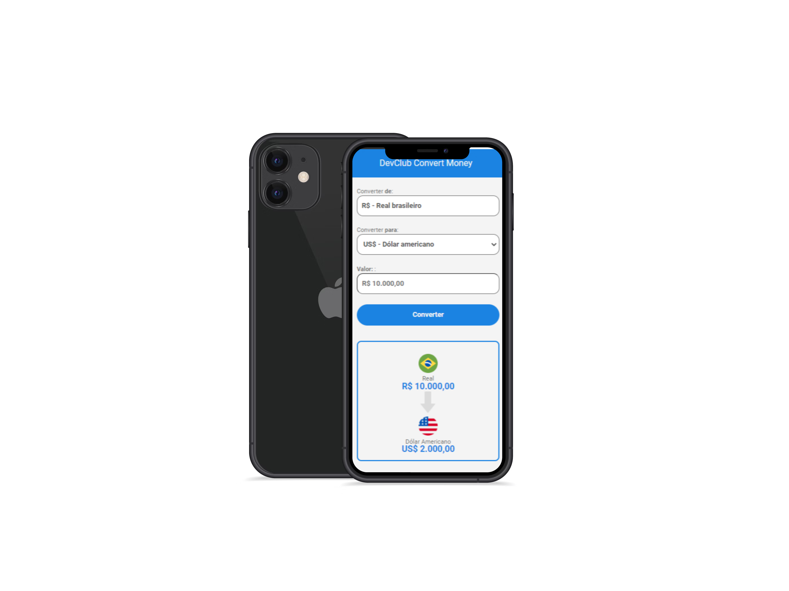

# Conversor-Money

<h1 align="center"> Calculadora Conversora de Dólar, Euro e BitCoin p/ Real. </h1>

 
 

<h3 align="center">Calculadora conversora de moedas com valor comercial atribuídos de forma simultânea através de uma Api de Cotação dos valores das moedas e com efeitos de conversão efetuados através do Javascript.</h3>
<h4 align="center">Baseada originalmente em uma estrutura para versão mobile, o app reúne aplicações de fundamentos desenvolvidos em HTML, CSS e JavaScript. 

 

 
 
<h2 align="center">Resultado:</h2>

<label> Interface do App</label>

<label> Conversão para Dólar</label>

<label> Conversão para Euro</label>

<label> Conversão para Bitcoin</label>

 

<h2 align="center">Tecnologias utilizadas no Projeto:</h2>

 

 

 

  
 

<h2 align="center">Fase do Projeto:</h2>

 <b>Status do Projeto:</b> Concluido :heavy_check_mark:

